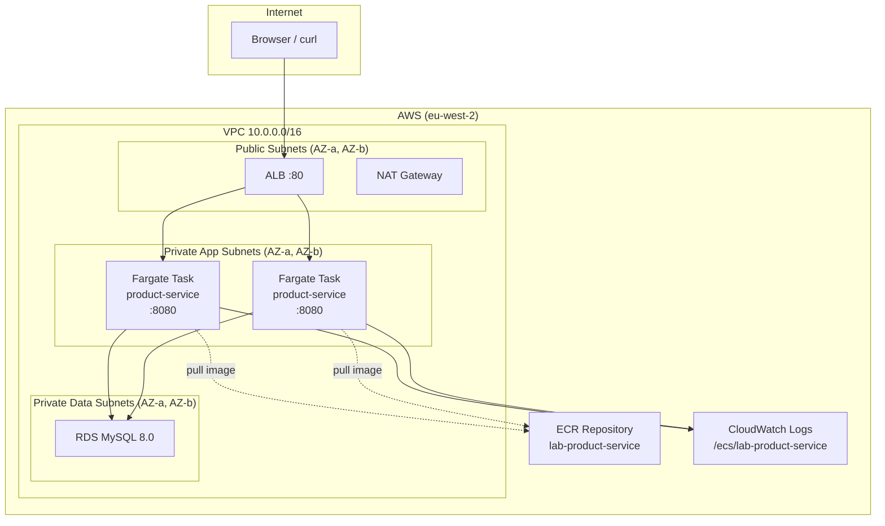

# Architecture: ECS Fargate Three-Tier

## What changed from Lab 1

EC2 instances are replaced by ECS Fargate tasks. The VPC, ALB, RDS, and subnet layout are identical — only the **application tier** changes.

```
Lab 1:  ALB → EC2 (systemd, JAR on disk) → RDS
Lab 2:  ALB → ECS Fargate tasks (container, ECR image) → RDS
```

## Infrastructure Diagram



## Key Differences vs Lab 1 (EC2)

| Aspect | Lab 1 EC2 | Lab 2 ECS Fargate |
|--------|-----------|-------------------|
| Deployment unit | JAR file on disk | Docker image in ECR |
| Scaling | Manual: launch new instance | `desired_count` in ECS service |
| Patching OS | Manual yum update | New image build replaces container |
| Networking | ENI on EC2 instance | ENI per task (awsvpc mode) |
| Target group type | `instance` (EC2 instance ID) | `ip` (task private IP) |
| Config injection | env file `/opt/webapp/env.conf` | ECS task definition environment variables |
| Logs | CloudWatch Agent on EC2 | awslogs driver in container |
