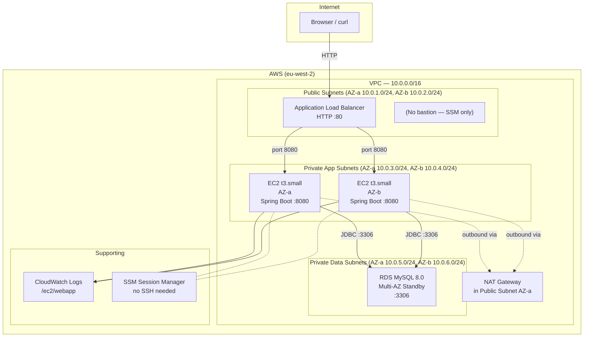
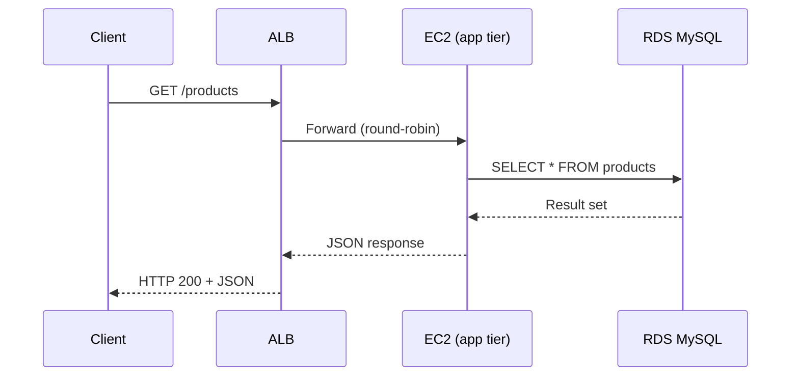

# Architecture: Three-Tier Web App on AWS

## Overview

A classic three-tier architecture: presentation (ALB), application (EC2), and data (RDS MySQL) — each tier in its own subnet layer, isolated by security groups.

## Infrastructure Diagram



## Security Group Rules

```
ALB Security Group (lab-alb-sg)
  Inbound:  0.0.0.0/0  → TCP 80
  Outbound: all

App Security Group (lab-app-sg)
  Inbound:  lab-alb-sg → TCP 8080   (ALB only, not the internet)
  Outbound: all

DB Security Group (lab-db-sg)
  Inbound:  lab-app-sg → TCP 3306   (app tier only)
  Outbound: all
```

## Request Flow



## Tier Responsibilities

| Tier | Component | Responsibility |
|------|-----------|----------------|
| Presentation | ALB | Receives internet traffic, health checks, distributes to app tier |
| Application | EC2 + Spring Boot | Business logic, JDBC reads/writes, exposes REST API |
| Data | RDS MySQL | Persistent storage, transactions, backups |

## Subnet Design

| Subnet | CIDR | Purpose |
|--------|------|---------|
| public-a | 10.0.1.0/24 | ALB node, NAT Gateway |
| public-b | 10.0.2.0/24 | ALB node (second AZ required) |
| private-app-a | 10.0.3.0/24 | EC2 app instances AZ-a |
| private-app-b | 10.0.4.0/24 | EC2 app instances AZ-b |
| private-data-a | 10.0.5.0/24 | RDS primary |
| private-data-b | 10.0.6.0/24 | RDS standby (Multi-AZ) |
